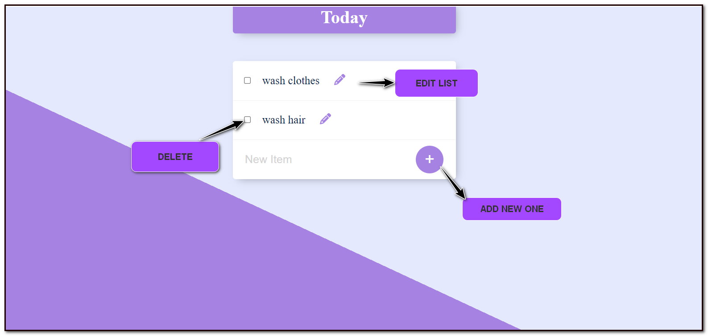

# To-Do List Application

A web-based to-do list application that allows users to add, edit, and delete tasks. The app uses **HTML**, **CSS**, and **JavaScript** on the frontend, and **Node.js**, **Express**, and **PostgreSQL** on the backend.

## Features

- **Add New Task**: Use the `+` button to create a new task in the list.
- **Edit Task**: Use the pencil icon to modify an existing task.
- **Delete Task**: Use the checkbox to select and delete tasks.
- **Persistent Data**: Tasks are stored in a PostgreSQL database, ensuring data remains even after refreshing the page.

## Technologies Used

### Frontend

- **HTML**
- **CSS**
- **JavaScript**

### Backend

- **Node.js**
- **Express.js**
- **PostgreSQL**

## Installation

### Prerequisites

- **Node.js** installed.
- **PostgreSQL** database setup.

### Setup

1. Clone the repository:

    ```bash
    git clone https://github.com/your-username/todo-list-app.git
    cd todo-list-app
    ```

2. Install the required dependencies:

    ```bash
    npm install
    ```

3. Setup the PostgreSQL database:

    - Create a database named `todo_db`.
    - Create a table named `items`:

    ```sql
    CREATE TABLE items (
      id SERIAL PRIMARY KEY,
      task_name VARCHAR(255) NOT NULL,
      is_completed BOOLEAN DEFAULT FALSE
    );
    ```

4. Configure environment variables:

    - Create a `.env` file in the root of the project and add the following:

    ```bash
    DB_USER=your_username
    DB_PASSWORD=your_password
    DB_HOST=localhost
    DB_PORT=5432
    DB_NAME=todo_db
    ```

5. Start the server:

    ```bash
    npm start
    ```

6. Open `http://localhost:3000` in your browser to access the app.

## API Endpoints

- **GET /items**: Retrieve all tasks.
- **POST /items**: Add a new task.
- **PUT /items/:id**: Update an existing task.
- **DELETE /items/:id**: Delete a task.

## Usage

1. **Add a Task**:
    - Click the `+` button and enter a new task name.

2. **Edit a Task**:
    - Click the pencil icon next to a task, edit the name, and save the changes.

3. **Delete a Task**:
    - Select the task using the checkbox and delete it.

## Screenshots



- **ADD NEW ONE**: Click the `+` button to add a task.
- **EDIT LIST**: Use the pencil icon to edit tasks.
- **DELETE**: Check the box to delete tasks.


## Video Sample
[<video controls src="assests/perma.mp4" title="Title"></video>](https://github.com/user-attachments/assets/0383e0ff-c611-4372-a060-8bf306dfd94e)
